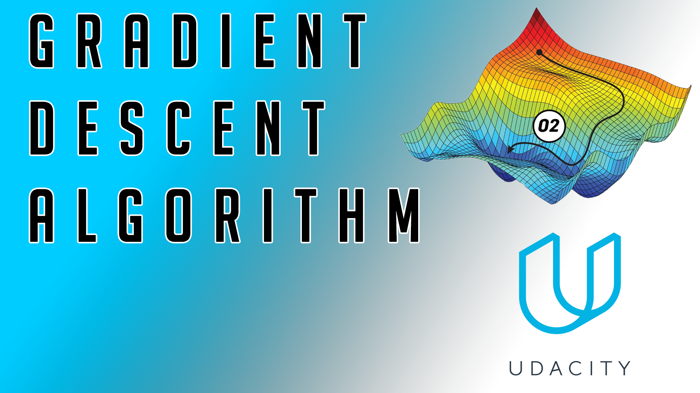

Udacity - Bertelsmann AI Scholarship
================

> This repository is for tracking purposes during my AI Scholarship from Bertelsmann in cooperation with Udacity.

 

🎥 - **My [YouTube Channel](https://www.youtube.com/user/TheEngiineer)**

Lesson 3
================

<table width="100%">
    <tr>
        <td width="50%">
            <H2>Implementation of the AND Perceptron</H2>
            By clicking on the picture you will be redirected to the Jupyter Notebook.
        <td width="50%"></td>
    </tr>
</table>
 

<table width="100%">
    <tr>
        <td width="50%">
        
        <td width="50%"><H2>Implementation of the NOT Perceptron</H2>
        By clicking on the picture you will be redirected to the Jupyter Notebook for the implementation of the NOT Perceptron </td>
    </tr>
</table>
 

<table width="100%">
    <tr>
        <td width="50%">
            <H2>Implementation of the Gradient Descent Algorithm</H2>
            In this repository you will find the code as a Jupyter notebook.
        <td width="50%"></td>
    </tr>
</table>
 

<table width="100%">
    <tr>
        <td width="50%">
        
        <td width="50%"><H2>Unclassified Notebook - TBD</H2>
        Next Session Will Follow Soon. </td>
    </tr>
</table>
 